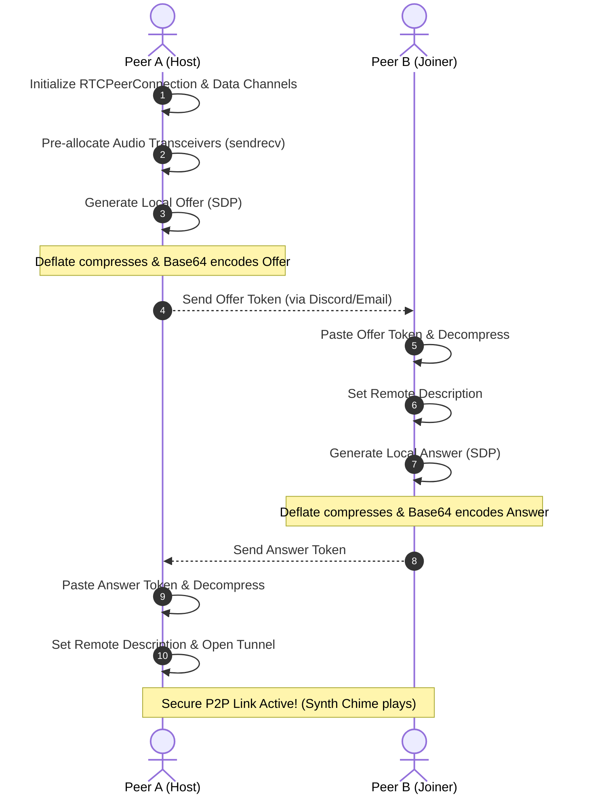

# DeadDrop P2P - Serverless Command Console, VoIP & File Share

DeadDrop is a serverless, zero-cloud peer-to-peer (P2P) web terminal that enables two users to establish a secure, direct communication link. It features a retro glowing CRT command console aesthetic and facilitates real-time chat, automated self-destruct timers, direct VoIP voice calls, and flow-controlled file streaming.

By utilizing **WebRTC Data Channels and Media Transceivers**, DeadDrop bypasses standard cloud uploads, allowing users to communicate and share files directly browser-to-browser.

---

## Key Features

- **No Signaling Servers:** Handshakes are performed manually by copying and pasting compressed connection tokens.
- **SDP Deflate Compression:** Shrinks SDP signaling tokens using the browser's native `CompressionStream` API (deflate algorithm), compressing tokens by **~60%** to comfortably fit within standard chat app limits (such as Discord's 2,000-character limit).
- **Bilateral Voice Call (VoIP):** Real-time voice calls using microphone streams pre-configured through audio transceivers, enabling dynamic call toggling without renegotiating connection codes.
- **Auto-Syncing Burn Mode:** Self-destructing messages with a 10-second countdown. Toggling the mode synchronizes the state across both peers instantly and triggers warning synth ticks.
- **CLI Command Shell:** Chat input acts as a mock Unix terminal shell. Commands include:
  - `/ping` - Calculates real-time round-trip latency (RTT) between browsers.
  - `/status` - Displays link specifications, active state, and session statistics (bytes TX/RX).
  - `/voice` - Toggles the VoIP line.
  - `/burn` - Toggles self-destruct mode.
  - `/clear` - Wipes the console logs.
- **O(1) Space Complexity File Streaming:** Divides files into `16KB` chunks and throttles transmission speed using WebRTC backpressure queue checks. Bypasses browser memory limits by streaming bytes directly to/from the file system via the native **File System Access API**, maintaining a low, constant memory footprint regardless of file size.
- **Real-Time Cryptographic File Verification:** Computes SHA-256 checksums incrementally on the fly as data slices are sent and received. Detects packet corruption or disk-write issues without pre-hash delays or post-transfer file re-reads.
- **DTLS Short Authentication String (SAS) Verification:** Derives a 6-character authentication string from the lexicographically sorted SHA-256 hash of both peers' DTLS certificate fingerprints to prevent Man-in-the-Middle (MitM) attacks.
- **Decoupled Event-Driven Architecture:** Core networking and protocol state are built on top of the native browser `EventTarget` class, cleanly separating UI rendering and DOM logic from connection states.
- **Retro Audio Synthesizer:** Programmatic sound generation (link success, message beeps, file completion sweeps, and warning ticks) powered by the browser's native **Web Audio API** (zero asset downloads).

---

## How It Works (The WebRTC Handshake)

DeadDrop removes WebSocket signaling dependencies by replacing them with manual copy-pasting:



---

## Technical Implementations

### 1. SDP Compression (Bypassing Limits)
Browser SDP records are naturally massive (~3.5KB). DeadDrop uses the native browser `CompressionStream` API to deflate the text prior to base64 encoding, preventing truncation when shared over chats:
```javascript
const stream = new Blob([sdpString]).stream();
const compressedStream = stream.pipeThrough(new CompressionStream('deflate'));
const buffer = await new Response(compressedStream).arrayBuffer();
const compressedBase64 = btoa(String.fromCharCode(...new Uint8Array(buffer)));
```

### 2. Flow Control & Direct-to-Disk Writing
To prevent browser memory crashes during large file transfers, DeadDrop utilizes backpressure checks alongside the File System Access API:
```javascript
// Flow control: Wait if outgoing WebRTC buffer exceeds 1MB
if (this.fileChannel.bufferedAmount > 1048576) {
    this.fileChannel.onbufferedamountlow = () => {
        this.fileChannel.onbufferedamountlow = null;
        streamNext(); // Resume slice read
    };
    return;
}

// Receiver: Direct disk stream writing
this.fileWritableStream.write(incomingBuffer);
```

### 3. Concurrent SHA-256 File Hashing
Rather than pre-hashing files (which causes noticeable UI freezes on large files) or post-transfer re-reading (which temporarily spikes RAM usage and causes disk I/O bottlenecks), DeadDrop hashes slices concurrently as they flow through the connection:
```javascript
// During transmission:
this.sendHasher.update(arrayBuffer); // Accumulate chunk hash on read

// During receiving:
this.recvHasher.update(incomingBuffer); // Accumulate chunk hash on write
```

### 4. Real-Time Audio VoIP Integration
Using pre-allocated audio transceivers, microphone tracks can be dynamically replaced on active connections without secondary renegotiation cycles:
```javascript
const senders = this.peerConnection.getSenders();
const audioSender = senders.find(s => s.track && s.track.kind === 'audio');
audioSender.replaceTrack(microphoneStream.getAudioTracks()[0]);
```

---

## Security and Trust Model

### DTLS Encryption
All WebRTC data channels and media streams are encrypted end-to-end using DTLS (Datagram Transport Layer Security) and SRTP (Secure Real-time Transport Protocol). Eavesdroppers on the network path cannot read or modify the connection payloads.

### Short Authentication String (SAS) Verification
Because DeadDrop uses manual copy-pasting for signaling, it is vulnerable to an active attacker who can intercept and replace the connection tokens (a Man-in-the-Middle or MitM attack). If an attacker intercepts Peer A's offer, sends their own offer to Peer B, and proxies the traffic, they can decrypt the connection.

To detect this, DeadDrop implements a **Short Authentication String (SAS)** derived from the DTLS fingerprints:
1. Both peers extract the SHA-256 fingerprints of the certificates exchanged during the DTLS handshake.
2. The fingerprints are sorted lexicographically (making the operation order-independent) and concatenated:
   `fingerprints = [localFingerprint, remoteFingerprint].sort().join('|')`
3. The combined string is hashed via SHA-256, and the first 6 hex characters are displayed as a code (e.g., `3D-A4-5C`).
4. If both users verify that their displayed codes match over a trusted out-of-band channel (e.g., reading it aloud during the voice call, or via a separate authenticated message), they gain strong assurance that no attacker has tampered with the signaling exchange.

#### Scope of the SAS Model
* **What it protects against:** Eavesdropping or active manipulation of the handshakes during the manual copy-paste exchange.
* **What it does not protect against:** Compromise of the endpoint devices themselves (e.g., screen loggers or browser extension vulnerabilities), or social engineering attacks where a user accepts a connection code from an untrusted party.
* **Assumptions:** The model assumes the out-of-band channel used for SAS verification (e.g., the user's voice) is authentic and hard to forge in real-time.

---

## Running Locally

To run and test the project:

1. Clone this repository:
   ```bash
   git clone https://github.com/aadi1105/p2p-dead-drop.git
   cd p2p-dead-drop
   ```
2. Start a local HTTP server:
   ```bash
   python -m http.server 8000
   ```
3. Open `http://127.0.0.1:8000` in two browser tabs.

---

## Deployment

Since this is a client-side application, it can be hosted for free on **GitHub Pages**, **Vercel**, or **Cloudflare Pages**. Enable Pages in your GitHub Repository settings pointing to the `main` branch.
