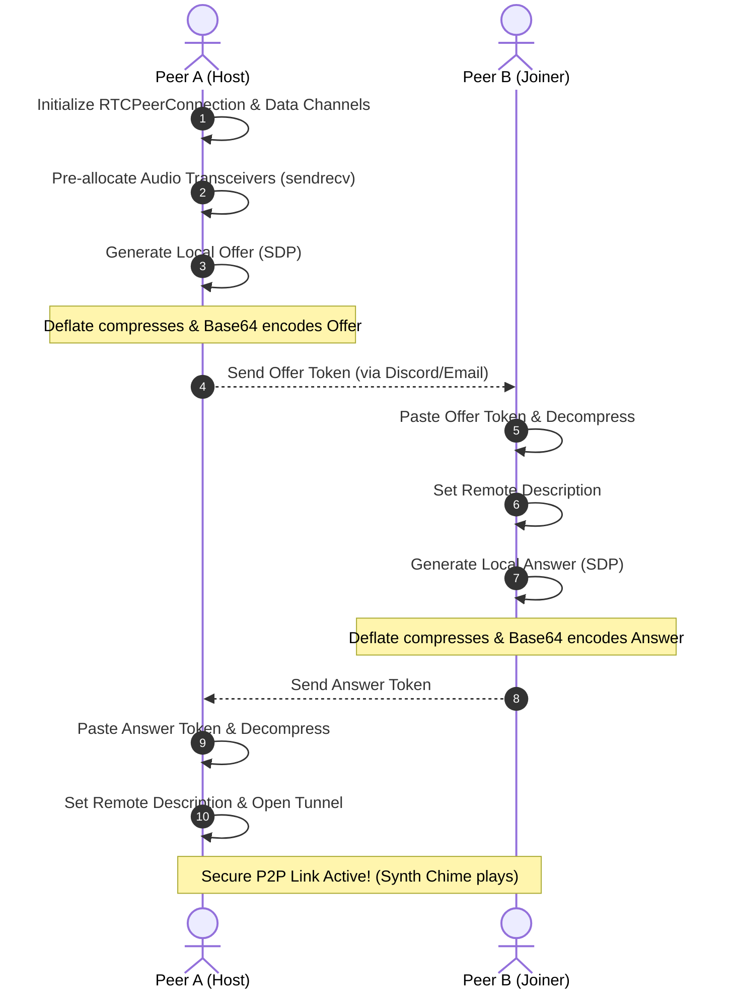

# DeadDrop P2P - Serverless Command Console, VoIP & File Share

DeadDrop is a serverless, zero-cloud peer-to-peer (P2P) web terminal that enables two users to establish a secure, direct communication link. It features a retro glowing CRT command console aesthetic and facilitates real-time chat, automated self-destruct timers, direct VoIP voice calls, and flow-controlled file streaming.

By utilizing **WebRTC Data Channels and Media Transceivers**, DeadDrop bypasses standard cloud uploads, allowing users to communicate and share files of virtually any size directly browser-to-browser.

---

## Key Features

- **No Servers Required:** Signaling is accomplished "hacker-style" by copy-pasting compressed connection tokens.
- **SDP Deflate Compression:** Compresses SDP signaling tokens using the browser's native `CompressionStream` API, shrinking token sizes by **~60%** to easily fit within Discord's 2,000-character limit.
- **Bilateral Voice Call (VoIP):** Real-time voice calls using microphone streams pre-configured through audio transceivers, enabling dynamic call toggling without renegotiating connection codes.
- **Auto-Syncing Burn Mode:** Self-destructing messages with a 10-second countdown. Toggling the mode synchronizes the state across both peers instantly and triggers warning synth ticks.
- **CLI Command Shell:** Chat input acts as a mock Unix terminal shell. Commands include:
  - `/ping` - Calculates real-time round-trip latency (RTT) between browsers.
  - `/status` - Displays link specifications, active state, and session statistics (bytes TX/RX).
  - `/voice` - Toggles the VoIP line.
  - `/burn` - Toggles self-destruct mode.
  - `/clear` - Wipes the console logs.
- **Flow-Controlled Disk Streaming:** Divides files into `16KB` chunks and throttles transmission speed using WebRTC backpressure queue checks.
- **Direct-to-Disk API:** Uses the browser's native **File System Access API** (`showSaveFilePicker`) to stream incoming bytes directly to the hard drive, maintaining **0 MB RAM usage** and supporting files of unlimited size (20GB+).
- **File History Log:** An active log tracking file name, direction (TX/RX), size, transfer time, and saving method.
- **Retro Audio Synthesizer:** Programmatic sound generation (link success, message beeps, file completion sweeps, and warning ticks) powered by the browser's native **Web Audio API** (zero asset downloads).

---

## How It Works (The WebRTC Handshake)

DeadDrop removes WebSocket signaling dependencies by replacing them with manual copy-pasting:



---

## Technical Implementations

### 1. SDP Compression (Bypassing Limits)
Browser SDP records are naturally massive (~3.5KB). DeadDrop uses the native browser `CompressionStream` API to deflate the text prior to base64 encoding, preventing truncation when shared over chats like Discord:
```javascript
const stream = new Blob([sdpString]).stream();
const compressedStream = stream.pipeThrough(new CompressionStream('deflate'));
const buffer = await new Response(compressedStream).arrayBuffer();
const compressedBase64 = btoa(String.fromCharCode(...new Uint8Array(buffer)));
```

### 2. Flow Control & Direct-to-Disk Writing
To prevent browser memory crashes during large file transfers, DeadDrop utilizes backpressure checks alongside the File System Access API:
```javascript
// Flow control: Wait if outgoing WebRTC buffer exceeds 1MB
if (this.fileChannel.bufferedAmount > 1048576) {
    this.fileChannel.onbufferedamountlow = () => {
        this.fileChannel.onbufferedamountlow = null;
        streamNext(); // Resume slice read
    };
    return;
}

// Receiver: Direct disk stream writing
this.fileWritableStream.write(incomingBuffer);
```

### 3. Real-Time Audio VoIP Integration
Using pre-allocated audio transceivers, microphone tracks can be dynamically replaced on active connections without secondary renegotiation cycles:
```javascript
const senders = this.peerConnection.getSenders();
const audioSender = senders.find(s => s.track && s.track.kind === 'audio');
audioSender.replaceTrack(microphoneStream.getAudioTracks()[0]);
```

---

## Running Locally

To run and test the project:

1. Clone this repository:
   ```bash
   git clone https://github.com/aadi1105/p2p-dead-drop.git
   cd p2p-dead-drop
   ```
2. Start a local HTTP server:
   ```bash
   python -m http.server 8000
   ```
3. Open `http://127.0.0.1:8000` in two browser tabs.

---

## Deployment

Since this is a client-side application, it can be hosted for free on **GitHub Pages**, **Vercel**, or **Cloudflare Pages**. Enable Pages in your GitHub Repository settings pointing to the `main` branch.
