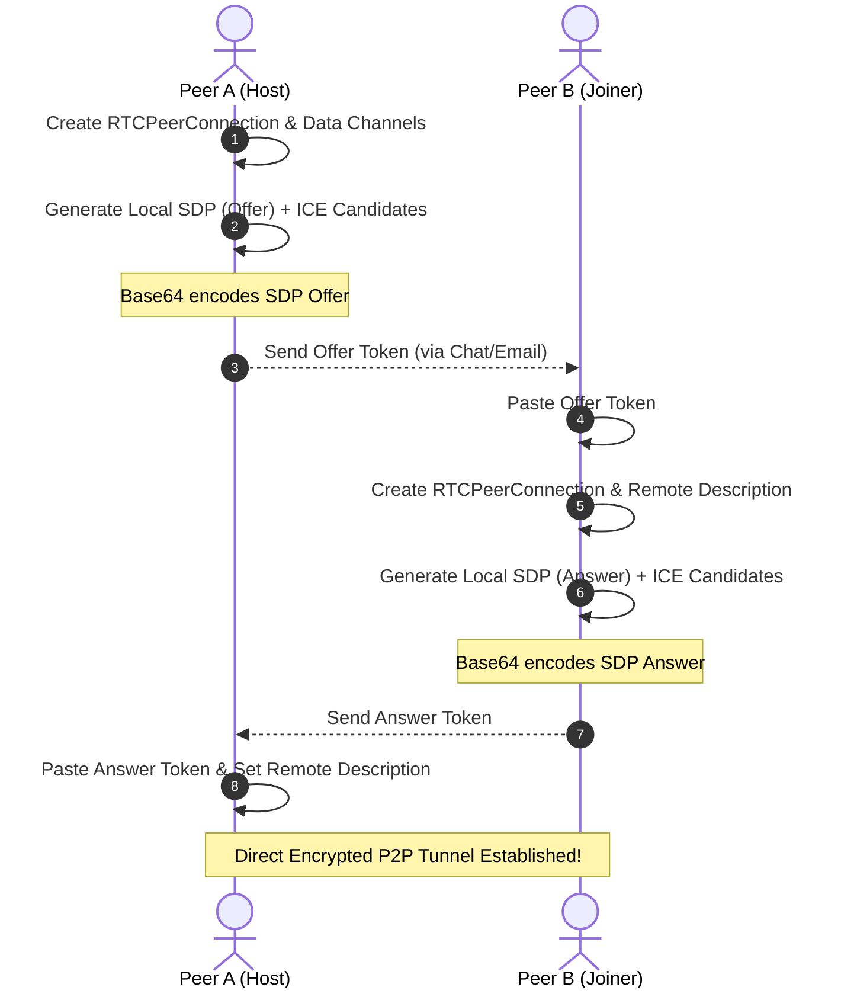

# DeadDrop P2P - Serverless Chat & File Stream

DeadDrop is a completely serverless, zero-cloud web application that enables two peers to establish a direct, encrypted connection for text chat and file streaming. 

By utilizing **WebRTC Data Channels**, DeadDrop bypasses standard cloud uploads, allowing users to send files of virtually any size directly browser-to-browser.

---

## Key Features

- **No Servers Required:** Signaling is accomplished "hacker-style" by manually copy-pasting Base64 connection codes.
- **Backpressure & Flow Control:** Implements smart buffer monitoring to stream large files (GBs+) without memory or queue overflows.
- **Private & Secure:** End-to-end encrypted (E2EE) by WebRTC. Your messages and files never touch a third-party server.
- **Glassmorphism UI:** A sleek, fully responsive dark-mode dashboard with glow effects and micro-animations.

---

## How It Works (The WebRTC Handshake)

In standard WebRTC setups, a central **Signaling Server** (like WebSockets) is used to exchange connection data. DeadDrop removes this dependency entirely, replacing it with manual copy-pasting:



---

## Technical Details

### 1. Flow Control & Backpressure Management
WebRTC data channels will crash if you attempt to flood them with binary data faster than the connection can transmit. To solve this, DeadDrop divides files into `16KB` chunks and tracks the queue size using `RTCDataChannel.bufferedAmount`:

```javascript
// Excerpt from webrtc.js
const streamNext = () => {
    // If WebRTC internal buffer is over 1MB, wait for it to drain
    if (this.fileChannel.bufferedAmount > 1048576) {
        this.fileChannel.onbufferedamountlow = () => {
            this.fileChannel.onbufferedamountlow = null;
            streamNext();
        };
        return;
    }

    const slice = file.slice(offset, offset + this.chunkSize);
    this.fileReader.readAsArrayBuffer(slice);
};
```
By binding to the `onbufferedamountlow` event, the sender automatically throttles its transmission speed to match the receiver's download bandwidth, ensuring stable transfers of large files.

### 2. NAT Traversal (STUN vs TURN)
DeadDrop is pre-configured with Google's public **STUN** servers. STUN allows the browser to discover its own public IP and port to bypass standard residential NATs/routers (works in ~75% of networks).

#### Limitations:
If you or your peer are behind strict enterprise firewalls, symmetric NATs (like 4G/5G mobile networks), or university proxies, a direct connection will fail. To bypass this, you can edit `webrtc.js` and add your own **TURN** relay server credentials into the `rtcConfig.iceServers` configuration.

---

## Running Locally

To run and test the project:

1. **Clone or download** this repository.
2. Spin up a local HTTP server in the project folder (WebRTC requires a local context or HTTPS):
   ```bash
   # Python
   python -m http.server 8000

   # Node.js
   npx serve .
   ```
3. Open two tabs at `http://127.0.0.1:8000` to test a connection on your own machine.

---

## Deployment

Since the application is 100% client-side (no backend database or active server process), you can host it for free on:
* **GitHub Pages**
* **Vercel / Netlify**
* **Cloudflare Pages**
