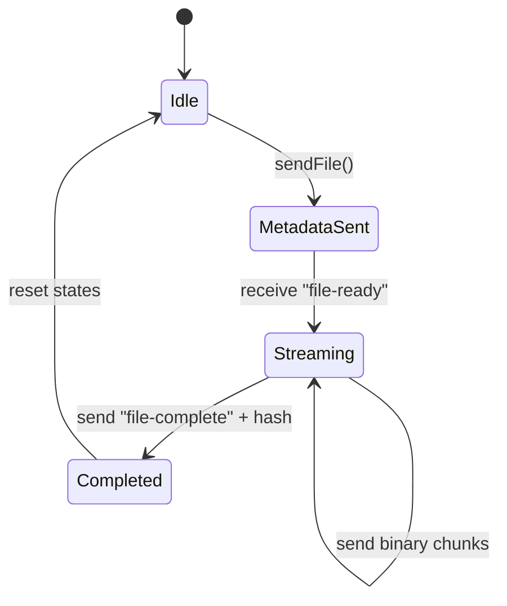

# DeadDrop P2P Transport Protocol Specification (DDPT/1.0)

**Document Status:** Informational / Specification  
**Author:** DeadDrop Systems Engineering  
**Date:** July 11, 2026  
**Protocol Version:** 1.0  

---

## 1. Introduction & Design Goals

The DeadDrop P2P Transport Protocol (DDPT) is a serverless, end-to-end encrypted protocol designed to establish peer-to-peer communication and file transfers directly between two browser contexts without requiring intermediate storage, coordination servers, or signaling infrastructure. 

### Design Goals
* **Zero-Infrastructure Signaling:** The protocol MUST support manual signaling (copy-pasting tokens) to negotiate network connections without relay servers.
* **O(1) Space Complexity:** Binary file transfers MUST stream incrementally with flow control to maintain a flat memory footprint, regardless of payload size.
* **Cryptographic Authenticity:** The protocol MUST verify payload integrity and provide out-of-band peer authentication mechanisms.
* **Extensibility:** The protocol MUST allow backwards-compatible upgrades to schemas and control flow.

---

## 2. Terminology

The key words "MUST", "MUST NOT", "REQUIRED", "SHALL", "SHALL NOT", "SHOULD", "SHOULD NOT", "RECOMMENDED", "MAY", and "OPTIONAL" in this document are to be interpreted as described in RFC 2119.

* **Host (Peer A):** The peer that initiates the connection request by generating the initial Session Description Protocol (SDP) Offer.
* **Joiner (Peer B):** The peer that accepts the Host's offer and generates the corresponding SDP Answer.
* **Manual Signaling:** The process of exchanging connection codes (SDPs and ICE candidates) via user-mediated out-of-band channels (e.g., messaging apps).
* **Short Authentication String (SAS):** A human-readable verification code derived from DTLS fingerprints.

---

## 3. Connection Lifecycle

The connection sequence is divided into five phases:

```
[Signaling (SDP)] ➔ [ICE Gathering] ➔ [DTLS Handshake] ➔ [DataChannel Setup] ➔ [P2P Ready]
```

### 3.1 Signaling & ICE Gathering
1. The **Host** MUST create a new WebRTC `RTCPeerConnection` instance.
2. The **Host** MUST pre-configure an audio transceiver with direction `sendrecv`.
3. The **Host** MUST create two data channels: `chat` and `file`.
4. The **Host** MUST generate an SDP Offer. Local ICE gathering begins.
5. Once ICE gathering is complete (`iceGatheringState == 'complete'`), the Host MUST combine the SDP Offer and all gathered candidates into a single JSON object.
6. The Host MUST compress the JSON string using the `deflate` algorithm and encode it as a Base64 string (the **Host Offer Token**).
7. The **Joiner** MUST receive the compressed token, decompress it, set it as the remote description, and generate an SDP Answer.
8. The **Joiner** MUST complete local ICE gathering, combine the SDP Answer and candidates, compress the payload using `deflate`, and encode it as a Base64 string (the **Joiner Answer Token**).
9. The Host MUST receive the Joiner's token, decompress it, and set it as the remote description.

---

## 4. Channel Assignments & Responsibilities

A DDPT-compliant implementation MUST support two WebRTC data channels and one media transceiver:

| Identifier | Protocol | Mode | Purpose |
|---|---|---|---|
| **`chat`** | SCTP (DataChannel) | Reliable, Ordered | Chat packets, self-destruct state sync, ping/pong diagnostics. |
| **`file`** | SCTP (DataChannel) | Reliable, Ordered | File transfer control messages (metadata, ready, complete) and binary chunk slices. |
| **`audio`** | SRTP (Transceiver) | Unreliable | VoIP voice stream transport. |

---

## 5. Message Schemas

All control and textual messages sent over data channels MUST be formatted in UTF-8 JSON.

### 5.1 Chat Channel Messages

#### Chat Message Packet
Sent to transmit text messages.
```json
{
  "type": "chat",
  "text": "Hello World",
  "selfDestruct": true
}
```
* **`type`**: MUST be `"chat"`.
* **`text`**: The text string containing the message.
* **`selfDestruct`**: A boolean indicating whether the message should destroy itself after display. If true, the receiver SHOULD delete the message 10 seconds after rendering.

#### Control Packet: Burn Mode Sync
Sent to synchronize self-destruct mode.
```json
{
  "type": "control",
  "action": "toggle-burn",
  "value": true
}
```
* **`type`**: MUST be `"control"`.
* **`action`**: MUST be `"toggle-burn"`.
* **`value`**: Boolean state of burn mode. Both clients MUST update their default outgoing message flags to match this value.

#### Control Packet: Latency Ping
Sent to measure round-trip latency.
```json
{
  "type": "control",
  "action": "ping",
  "value": 1782635489000
}
```
* **`type`**: MUST be `"control"`.
* **`action`**: MUST be `"ping"`.
* **`value`**: Timestamp of transmission (milliseconds since epoch).

#### Control Packet: Latency Pong
Sent in response to a ping.
```json
{
  "type": "control",
  "action": "pong",
  "value": 1782635489000
}
```
* **`type`**: MUST be `"control"`.
* **`action`**: MUST be `"pong"`.
* **`value`**: The identical timestamp received in the ping packet.

---

## 6. File Transfer Protocol (FTP) Lifecycle

File transfers run over the `file` data channel. Chunks MUST be streamed sequentially.



### 6.1 FTP Messages

#### File Metadata Packet (Sender to Receiver)
Sent to notify the peer of an incoming file stream.
```json
{
  "type": "file-metadata",
  "name": "backup.tar.gz",
  "size": 52428800,
  "mime": "application/gzip"
}
```
* **`type`**: MUST be `"file-metadata"`.
* **`name`**: File name.
* **`size`**: Total file size in bytes.
* **`mime`**: MIME type.

#### File Ready Packet (Receiver to Sender)
Sent to signal that the receiver is ready to accept the stream (e.g., file descriptor is open).
```json
{
  "type": "file-ready"
}
```
* **`type`**: MUST be `"file-ready"`.

#### File Complete Packet (Sender to Receiver)
Sent immediately after the last binary chunk is dispatched. Contains the sender-side calculated hash.
```json
{
  "type": "file-complete",
  "sha256": "5e884898da28047151d0e56f8dc6292773603d0d6aabbdd62a11ef721d1542d8"
}
```
* **`type`**: MUST be `"file-complete"`.
* **`sha256`**: The SHA-256 hexadecimal checksum calculated by the sender concurrently during transmission.

---

### 6.2 Stream Transmission & Flow Control
1. Files MUST be transmitted in chunk sizes not exceeding **16,384 bytes (16KB)**.
2. The sender MUST monitor the data channel's `bufferedAmount`.
3. If `bufferedAmount` exceeds **1,048,576 bytes (1MB)**, the sender MUST pause reading and sending slices until the channel triggers its `onbufferedamountlow` event (threshold set to **65,536 bytes**).

---

## 7. Cryptographic Trust Model & Verification

### 7.1 Security Scope
* **Confidentiality:** All session transport layers MUST be encrypted via DTLS. Eavesdroppers cannot view payload contents.
* **Handshake Authentication (SAS):** To detect active Man-in-the-Middle (MitM) interceptors modifying signaling tokens, peers calculate a Short Authentication String (SAS) derived from negotiated DTLS certificates.

### 7.2 SAS Calculation Algorithm
1. Extract the remote certificate's SHA-256 fingerprint from the remote SDP:
   `a=fingerprint:sha-256 XX:XX:XX...`
2. Extract the local certificate's SHA-256 fingerprint.
3. Sort both fingerprints lexicographically to ensure order-independence:
   `sorted = sort([localFingerprint, remoteFingerprint])`
4. Concatenate the sorted fingerprints using a pipe character delimiter:
   `combined = sorted[0] + "|" + sorted[1]`
5. Generate the SHA-256 hash of the UTF-8 representation of `combined`.
6. Format the first 6 hex characters of the digest in uppercase split by hyphens (e.g. `A4-F2-3C`).
7. Users SHOULD verify this SAS code over an out-of-band channel (such as the P2P VoIP call). If the codes match, they gain strong assurance of signaling integrity.

---

## 8. Versioning & Extensibility

To ensure future client updates can communicate with legacy implementations:
1. Every JSON control packet MAY include an optional integer key `"version"`. If omitted, version `1` is assumed.
2. If a client receives a packet with an unrecognized `"version"`, it SHOULD process known keys and ignore unrecognized keys, maintaining backwards compatibility.
3. When signaling formats change significantly, the handshake tokens MUST prepend a version indicator (e.g. `v2:compressedBase64String`). If no prefix is present, the parser MUST treat the string as a version `1` token.

---

## 9. Error Handling & Recovery

* **Handshake Corruption:** If decompression or parsing of an SDP token fails due to copy-paste truncation, the implementation MUST transition to a disconnected state and display a clear diagnostic error (e.g. "Decompression failed - token malformed").
* **Transfer Interruption:** If a data channel closes during file transmission, the receiver MUST immediately abort write operations, close and release the disk file descriptor, discard partial buffers, and notify the user of transfer failure.
* **VoIP Access Denial:** If a user denies microphone access during voice initialization, the transceiver direction MUST remain in a state that allows receiving remote audio without transmitting local tracks, preventing the peer connection from failing.
